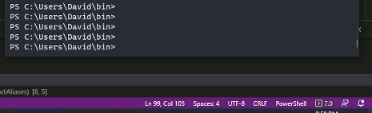

# Toast for Windows Version

My initial purpose was to alert users that their system had been updated to a newer version of Windows. The inclusion of the image was for branding. Limiting the number of files was important, so I am using an image converted to Base64. This process uses *[Burnt Toast](https://github.com/Windos/BurntToast).*

The end goal is to make an exportable Toast message that can be deployed without *Burnt Toast*.

|  |
| :---: |
| _A mockup of the Toast on my system._ |

## Image Conversion

Taken from [https://eddiejackson.net/wp/?p=23393](https://eddiejackson.net/wp/?p=23393)

Currently, I am getting the Base64 manually and assign it to ``$ImageFile``:

```powershell
[Convert]::ToBase64String([IO.File]::ReadAllBytes('~\myimage.png'))
```

Then the script reconstitutes with:

```powershell
$ImageFile = New-TemporaryFile | Select-Object -ExpandProperty FullName
[byte[]]$Bytes = [convert]::FromBase64String($ImageBase64)
[System.IO.File]::WriteAllBytes($ImageFile,$Bytes)
```

To avoid creating file to later delete, I am creating a temporary file and writing to it. So far BMP and PNG files work well, despite being named with a TMP extension.
